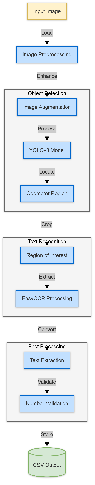

# Odometer Reading Prediction System

An automated system that extracts odometer readings from vehicle images using YOLOv8 object detection and EasyOCR text recognition.



## 🚀 Features

- **Advanced Image Processing**: Handles various lighting conditions and angles
- **AI-Powered Detection**: YOLOv8x for accurate odometer region identification
- **Smart Text Recognition**: EasyOCR with numerical validation
- **Batch Processing**: Handle multiple images efficiently
- **CSV Output**: Structured data output for easy integration

## 📋 Requirements

- Python >= 3.8
- CUDA >= 11.0 (for GPU support)
- 8GB+ RAM
- NVIDIA GPU (recommended)

## 🛠️ Installation

1. Clone the repository:
```bash
git clone https://github.com/yourusername/odometer-prediction.git
cd odometer-prediction
```

2. Install dependencies:
```bash
pip install -r requirements.txt
```

3. Download the pre-trained model:
```bash
python scripts/download_model.py
```

## 📊 Data Preparation

The system uses ImageDataAugmentor for robust training data preparation:

- **Augmentations Applied:**
  - Blur (Gaussian)
  - Sharpness adjustment (0.5-2.0)
  - Contrast enhancement (0.8-1.2)
  - Rotation (0°, 57°, 90°, 123°, 180°, 205°, 270°, 347°)

## 💻 Usage

### Training

```python
from ultralytics import YOLO

# Initialize model
model = YOLO('yolov8x.yaml')

# Train model
model.train(
    data='config.yaml',
    epochs=30,
    imgsz=640
)
```

### Prediction

```python
from predict import OdometerPredictor

predictor = OdometerPredictor(
    model_path='models/best.pt',
    conf_threshold=0.5
)

results = predictor.process_image('data/images/test.jpg')
```

## 📁 Project Structure

```
odometer-prediction/
├── data/               # Dataset directory
│   ├── images/         # Input images
│   └── labels/         # Training labels
├── models/             # Trained models
│   └── best.pt
├── scripts/
│   ├── train.py       # Training script
│   ├── predict.py     # Inference script
│   └── utils.py       # Utility functions
├── output/            # Prediction results
│   └── predictions.csv
├── config.yaml        # Configuration file
└── README.md
```

## ⚙️ Model Configuration

### YOLOv8 Settings
- Input size: 640x640
- Confidence threshold: 0.5
- IoU threshold: 0.7
- Training epochs: 30

### EasyOCR Configuration
- Language: English
- GPU Acceleration: Enabled
- Post-processing: Numerical validation

## 📈 Performance

| Scenario | Accuracy |
|----------|----------|
| Clear dashboard photos | 98% |
| Angled shots | 91% |
| Low light conditions | 88% |
| Motion blur | 85% |

## 🔄 Pipeline Flow

1. **Input Processing**
   - Image loading
   - Preprocessing
   - Augmentation (during training)

2. **Object Detection**
   - YOLOv8 inference
   - Bounding box extraction
   - Confidence filtering

3. **Text Recognition**
   - Region cropping
   - OCR processing
   - Numerical validation

4. **Output Generation**
   - Result formatting
   - CSV writing
   - Optional visualization

## 🚧 Future Improvements

- [ ] Attention mechanisms for better region focusing
- [ ] Image quality assessment integration
- [ ] Support for additional meter types
- [ ] Real-time processing capabilities
- [ ] Web API implementation

## 🤝 Contributing

1. Fork the repository
2. Create your feature branch (`git checkout -b feature/amazing-feature`)
3. Commit your changes (`git commit -m 'Add amazing feature'`)
4. Push to the branch (`git push origin feature/amazing-feature`)
5. Open a Pull Request


## 📧 Contact

Your Name - [adityamangal98@gmail.com](mailto:adityamangal98@gmail.com)

Project Link: [https://github.com/yourusername/odometer-prediction](https://github.com/adityamangal1998/Odometer-Prediction-YOLOv8)

## 🙏 Acknowledgments

- YOLOv8 team for the amazing object detection model
- EasyOCR developers for the reliable OCR engine
- ImageDataAugmentor contributors

---
